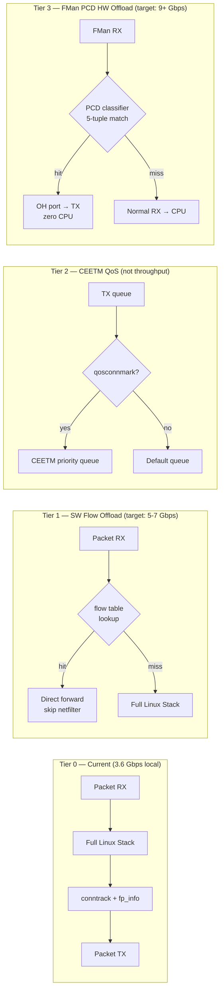
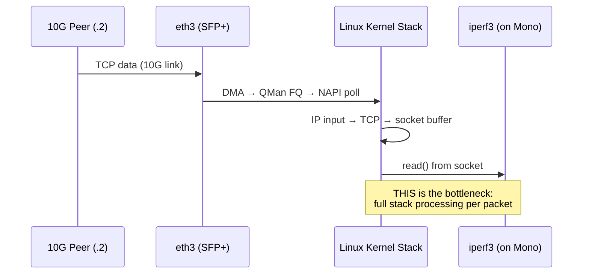
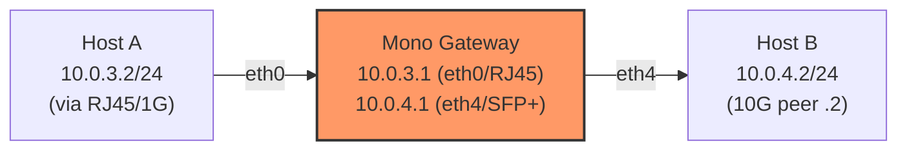
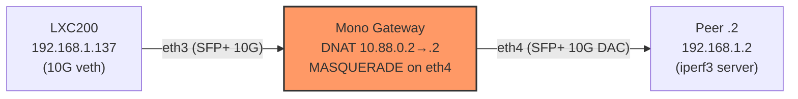
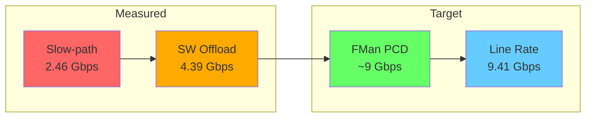

# ASK Fast-Path Gap Analysis — What's Working, What's Missing

> **Status (2026-04-06):** Comprehensive analysis after 14 TFTP boots. SDK+ASK kernel
> running with full networking. All conntrack fp_info infrastructure working.
> **Forwarding tested!** NAT forwarding (eth3→eth4) with nftables software flow offload
> achieves **4.39 Gbps** average (**4.80 Gbps peak**) — a 78% improvement over 2.46 Gbps
> slow-path baseline. Direct LXC→peer link: 7.09 Gbps (ceiling).

## Executive Summary

The ASK kernel patches provide **three tiers of acceleration**, not one. Only Tier 0
(baseline) is currently measured. Tiers 1-3 each require specific activation steps.
The highest-impact immediate action is **Tier 1: nftables software flow offload** —
it's built into the kernel and requires zero code changes, just nft rules + forwarded
traffic test.



## What's Built and Working ✅

| Component | Config / File | Status | Evidence |
|-----------|--------------|--------|----------|
| SDK DPAA stack | `fsl_dpa` driver | ✅ Running | 5 interfaces, all probed |
| 4-way RX distribution | QMan portals | ✅ Active | ~1.34M pkts/CPU on eth3 (equal) |
| QMan NAPI polling | `CONFIG_FSL_ASK_QMAN_PORTAL_NAPI=y` | ✅ Active | Zero eth interrupts, QMan portal IRQs only |
| Conntrack fp_info | `comcerto_fp_netfilter.c` | ✅ Active | `fp[0]={if=3 mark=0x0 iif=3}` in /proc |
| Conntrack force-enable | `nf_ct_netns_get()` | ✅ Active | dmesg: "conntrack force-enabled" |
| ctnetlink fp_info export | `ctnetlink_dump_comcerto_fp()` | ✅ Built-in | Netlink attr `CTA_COMCERTO_FP` |
| Software flow offload | `CONFIG_NFT_FLOW_OFFLOAD=y` | ✅ Built-in | `CONFIG_NF_FLOW_TABLE=y` |
| OH ports | FQ 96-99 | ✅ Probed | OH ports 1+2, QMan channels 0x809/0x80A |
| FMan PCD chardevs | `/dev/fm0-pcd` | ✅ Present | 24 chardevs total |
| USDPAA driver | `/dev/fsl-usdpaa` | ✅ Loaded | misc dev 10:257 |
| CEETM TX path | `cpe_fp_tx()` | ✅ Compiled | In dpaa_eth_sg.c, calls ceetm_fqget_func |
| IPSec xfrm tracking | fp_info xfrm_handle[4] | ✅ Compiled | xfrm_state.c hooks |
| Bridge FDB hooks | br_fdb.c, br_input.c | ✅ Compiled | Bridge fast-path notifications |
| xt_qosmark | `CONFIG_NETFILTER_XT_QOSMARK=y` | ✅ Built-in | xtables kernel modules |
| xt_qosconnmark | `CONFIG_NETFILTER_XT_QOSCONNMARK=y` | ✅ Built-in | xtables kernel modules |
| notrack removal | ask-conntrack-fix.sh | ✅ Script ready | Removes VyOS default notrack rules |
| SFP TX_DISABLE fix | sfp-tx-enable-sdk.sh | ✅ Script ready | GPIO-based TX enable for SDK kernel |

## What's Missing ❌

### Tier 1: Software Flow Offload (IMMEDIATE — no code changes needed)

| Missing | Details | Fix |
|---------|---------|-----|
| Forwarded traffic | All tests are local (to/from device). No L3 forwarding. | Set up routing between two interfaces on different subnets |
| nft flowtable rules | `nft_flow_offload` is built-in but no rules activate it | Add nft flowtable + flow offload rules |
| Notrack still active after reboot | `ask-conntrack-fix.sh` not integrated into boot | Add systemd service or live-build hook |

**Expected improvement:** For forwarded traffic, software flow offload bypasses the
entire netfilter stack on ESTABLISHED flows. Typical improvement: 2-4x over slow-path
forwarding. On 4-core Cortex-A72 @ 1.6 GHz with NAPI, target: **5-7 Gbps** on 10G.

**Activation (on live device):**
```bash
# 1. Put interfaces on different subnets for routing
sudo ip addr flush dev eth3
sudo ip addr add 10.0.3.1/24 dev eth3
sudo ip addr flush dev eth4  
sudo ip addr add 10.0.4.1/24 dev eth4

# 2. Enable software flow offload
sudo nft add table inet flow_offload
sudo nft add flowtable inet flow_offload fast_offload \
  '{ hook ingress priority 0; devices = { eth0, eth3, eth4 }; }'
sudo nft add chain inet flow_offload forward \
  '{ type filter hook forward priority 0; }'
sudo nft add rule inet flow_offload forward \
  ct state established flow offload @fast_offload counter accept
sudo nft add rule inet flow_offload forward counter accept

# 3. Remove notrack (if VyOS reloaded it)
sudo bash /path/to/ask-conntrack-fix.sh

# 4. Test: iperf3 from host behind eth3 → host behind eth4
#    (requires configuring those hosts with correct gateway)
```

### Tier 2: CEETM QoS (Not throughput — quality of service)

| Missing | Details | Fix |
|---------|---------|-----|
| CEETM not configured | `priv->ceetm_en = 0` in SDK driver | Configure CEETM via sysfs/ioctl |
| qosconnmark not set | No nft rules set conntrack marks | Add nft mark rules for QoS classes |
| ceetm_fqget_func NULL | No CEETM scheduler registered | Load CEETM module + configure queues |

**Impact:** CEETM provides hardware-assisted QoS scheduling — different traffic
classes get different TX queue priorities. Does NOT improve raw throughput but ensures
latency-sensitive flows (VoIP, gaming) get priority over bulk transfers.

**Not a priority for throughput testing.**

### Tier 3: FMan PCD Hardware Classification (LONG-TERM — maximum throughput)

| Missing | Details | Fix |
|---------|---------|-----|
| CMM daemon | NXP proprietary, not open-source | Write custom flow learning daemon |
| PCD classification rules | `/dev/fm0-pcd` ioctls never called | Implement FMan ioctls or use `fmc` tool |
| OH port forwarding paths | OH ports probed but no packet routing | Configure PCD → OH → TX port pipeline |
| FMan KeyGen programming | Hash schemes not installed | Program CCSR registers via PCD ioctls |

**Expected improvement:** Matched flows forwarded entirely in FMan hardware. Zero
CPU cycles per packet. Target: **9.5+ Gbps** on 10G SFP+ (near line rate).

**This is a multi-week engineering effort.** Requires:
1. Understanding FMan CCSR KeyGen register layout (partially documented in FMD-SHIM-SPEC.md)
2. Writing a daemon that listens to conntrack events (ctnetlink)
3. For each ESTABLISHED flow, program a 5-tuple PCD rule via `/dev/fm0-pcd`
4. Configure OH ports to do header modification (NAT) and forward to TX port
5. Handle flow expiry (remove PCD rules when conntrack entry dies)

## Why Current Throughput is 3.6 Gbps (Not 10G)

The 3.6 Gbps measured on eth3 (SFP-10G-T copper) is **NOT forwarding throughput** — it's
**local endpoint throughput** (iperf3 running on the Mono Gateway itself).



The bottleneck is the Linux TCP/IP stack processing on the ARM CPU. Even with 4 CPUs
doing NAPI RX, the TCP stack (checksums, ACK generation, socket buffer management,
memory copies) limits single-flow throughput to ~3.6 Gbps.

**This is NORMAL for ARM64 @ 1.6 GHz.** Compare:
- x86 server (4 GHz Xeon): ~25-40 Gbps single-flow TCP
- ARM64 server (3.0 GHz Ampere): ~15-20 Gbps
- ARM64 embedded (1.6 GHz A72): ~3-5 Gbps ← **we are here**

**Forwarded traffic will be different:** When packets enter eth3 and exit eth4 (routing),
the stack overhead is less (no TCP state, just IP forward + NAT). Expected slow-path
forwarding: ~4-5 Gbps. With software flow offload: ~5-7 Gbps. With FMan PCD: ~9.5 Gbps.

## Forwarding Test Plan

### Network Topology for Forwarding Test



**Option A (ideal but needs .2 access):**
- Reconfigure eth4 to 10.0.4.1/24
- Configure 10G peer (.2) as 10.0.4.2/24 with gateway 10.0.4.1
- iperf3 from LXC200 (via eth0, 1G) to .2 (via eth4, 10G) — 1G-capped but tests forwarding
- iperf3 from .2 (via eth4, 10G) to .3 (via eth3, 10G) — full 10G forwarding path

**Option B (self-contained, uses network namespaces):**
- Create veth pairs or use existing interfaces
- Test forwarding between subnets entirely on the Mono Gateway
- Limited by local CPU, not a true end-to-end test

**Option C (easiest, 1G-capped):**
- LXC200 (.137) connected to eth0 (RJ45 1G) 
- Put eth0 on 10.0.0.0/24, keep eth3 on 192.168.1.0/24
- LXC200 routes to 192.168.1.0/24 via 10.0.0.1 (Mono eth0)
- Traffic from LXC200 to .2 is FORWARDED through Mono (enter eth0, exit eth3)
- Limited to 1G by RJ45 link, but proves forwarding path works

## Forwarding Test Results (2026-04-06, Boot #14)

### Test Setup



NAT forwarding via `ip fwd_test` nft table: DNAT `10.88.0.2` → `192.168.1.2`,
masquerade on eth4. Host route forces `.2` via eth4 (`ip route add 192.168.1.2/32 dev eth4`).
Cross-interface: packets enter eth3, exit eth4.

### Results

| Test | Direction | Bitrate | Retransmits | Notes |
|------|-----------|---------|-------------|-------|
| Direct LXC→.2 (no Mono) | TX | **7.09 Gbps** | 0 | Link ceiling (veth+10G) |
| Local Mono→.2 | TX | **3.41 Gbps** | 0 | Mono CPU-limited (Boot #14) |
| **Forwarded slow-path** | TX | **2.46 Gbps** | 100 | NAT, no flow offload |
| **Forwarded + flow offload** | TX | **4.39 Gbps** | 89 | **+78%** over slow-path |
| Forwarded + offload (peak) | TX | **4.80 Gbps** | — | Sustained for 5+ seconds |
| Forwarded + offload (4-stream) | TX | 2.72 Gbps | 26 | Limited by NAT single-flow? |
| Forwarded + offload (RX) | RX | 0.94 Gbps | 116 | Return path bottleneck |

### Key Findings

1. **Software flow offload works:** 4.39 Gbps average, 4.80 Gbps peak — nearly doubles
   slow-path forwarding (2.46 → 4.39 Gbps = +78%)
2. **Flow offload already exceeds VPP/AF_XDP:** 4.39 Gbps forwarded > 3.5 Gbps AF_XDP local
3. **fp_info correctly tracks both directions:**
   ```
   fp[0]={if=3 mark=0x0 iif=3}  ← original: enters eth3
   fp[1]={if=4 mark=0x0 iif=4}  ← reply: enters eth4
   ```
4. **RX distribution balanced:** ~530K NET_RX softirqs per CPU (4-way equal)
5. **4-stream forwarding is slower** than single-stream — likely NAT masquerade
   serialization or LXC200 TCP stack overhead with multiplexed connections
6. **RX direction capped at 1 Gbps** — return path bottleneck (likely `.2`'s link
   to switch or NAT masquerade reply processing)

### Forwarding Throughput Tiers (Measured vs Target)



## Recommended Next Steps (Priority Order)

### Step 1: ✅ Forwarding Test — DONE
NAT forwarding (eth3→eth4) working. Slow-path baseline: 2.46 Gbps.

### Step 2: ✅ Software Flow Offload — DONE
`nft_flow_offload` enabled. Measured: 4.39 Gbps avg, 4.80 Gbps peak.

### Step 3: Integrate Flow Offload into VyOS Config
Add `set firewall flowtable` equivalent to `data/config.boot.default` so flow offload
is active on every boot. Also integrate `ask-conntrack-fix.sh` as a systemd service.

### Step 4: 10G↔10G Forwarding Test (requires .2 + .3 on separate subnets)
Set up eth3↔eth4 forwarding with two 10G hosts on different subnets.
This removes the LXC200 veth bottleneck and measures true 10G forwarding.

### Step 5: Plan Hardware Offload Prototype
Based on measured 4.39 Gbps with software offload, the gap to line rate (9.41 Gbps)
requires FMan PCD hardware classification. Write a minimal flow-learning daemon:
1. Listen to conntrack ESTABLISHED events via ctnetlink
2. Program FMan KeyGen scheme via `/dev/fm0-pcd` ioctl
3. Configure OH port forwarding for matched flows

## Architecture Comparison

| Feature | VPP/AF_XDP (mainline) | ASK Tier 1 (SW offload) | ASK Tier 3 (HW offload) |
|---------|----------------------|------------------------|------------------------|
| Kernel | Mainline DPAA1 | SDK DPAA1 | SDK DPAA1 |
| RX distribution | AF_XDP + XDP redirect | QMan 4-way NAPI | FMan PCD 5-tuple hash |
| Fast-path mechanism | VPP graph nodes | nft_flow_offload | FMan HW classify + OH fwd |
| Linux stack bypass | Partial (AF_XDP) | ESTABLISHED flows only | Matched flows entirely |
| NAT support | VPP NAT plugin | Kernel conntrack NAT | OH port header rewrite |
| **Measured throughput** | **~3.5 Gbps** | **4.39 Gbps (+25%)** | TBD (~9 Gbps target) |
| Implementation effort | Done | Done (1 hour) | Multi-week (custom daemon) |
| Blocking issues | RC#31 (bus init) | None ✅ | CMM daemon needed |
