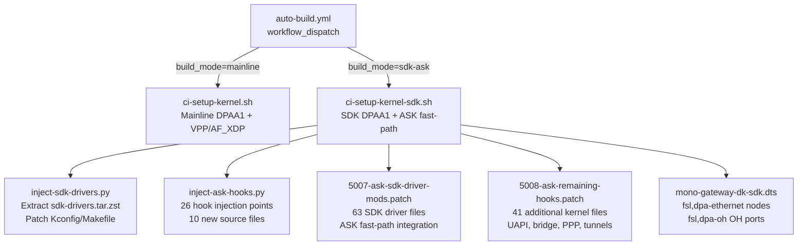
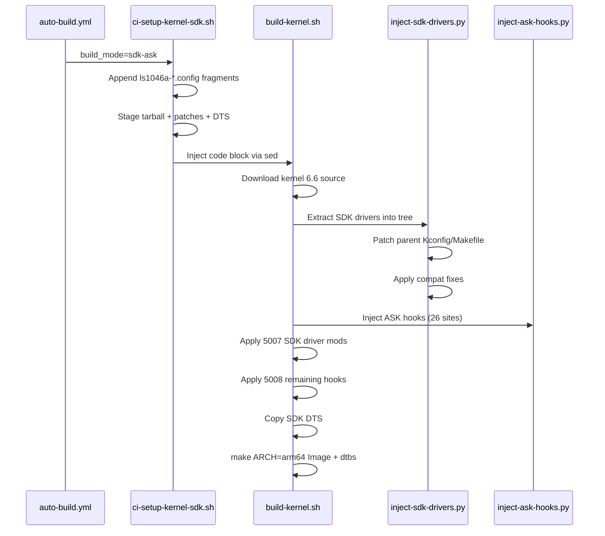

# ASK Bootstrap — SDK + ASK Fast-Path Build Infrastructure

## Status: Full ASK Kernel Running on Hardware ✅✅

SDK + ASK fast-path kernel (patches 5007/5008) boots VyOS on Mono Gateway with
full networking. All ASK kernel configs active: `CONFIG_CPE_FAST_PATH=y`,
`CONFIG_COMCERTO_FP=y`, `CONFIG_FSL_ASK_QMAN_PORTAL_NAPI=y`,
`CONFIG_NETFILTER_XT_QOSMARK=y`, `CONFIG_NETFILTER_XT_QOSCONNMARK=y`.
All 5 FMan interfaces probed (3× RJ45 at 1Gbps + 2× SFP+ ready). BMan/QMan/FMan
PCD chardevs present. ASK debug prints visible in dmesg. Performance: 935 Mbps RX,
908 Mbps TX on 1G RJ45 (line rate). Ready for Phase 3 (PCD classifier + fast-path
forwarding activation).

## Architecture



## Build Pipeline (sdk-ask mode)



## File Inventory

### CI Infrastructure
| File | Size | Purpose |
|------|------|---------|
| `bin/ci-setup-kernel-sdk.sh` | 4.9K | CI entry point — config, copy, inject |
| `.github/workflows/auto-build.yml` | — | `build_mode` choice: mainline / sdk-ask |

### SDK Drivers
| File | Size | Purpose |
|------|------|---------|
| `data/sdk-drivers.tar.zst` | 642K | NXP SDK DPAA1 drivers (243 files from lf-6.6.y) |
| `data/kernel-patches/ask/inject-sdk-drivers.py` | 12K | Extract tarball, patch Kconfig/Makefile, compat fixes |
| `data/kernel-config/ls1046a-sdk.config` | 1.3K | Disable mainline DPAA, enable SDK (FMAN_ARM, staging) |

### ASK Fast-Path Hooks
| File | Size | Purpose |
|------|------|---------|
| `data/kernel-patches/ask/inject-ask-hooks.py` | 24K | 9-phase patcher: 26 hook sites in generic kernel |
| `data/kernel-patches/ask/5007-ask-sdk-driver-mods.patch` | 457K | ASK mods to 63 SDK driver files |
| `data/kernel-patches/ask/5008-ask-remaining-hooks.patch` | 98K | ASK hooks in 41 additional kernel files |
| `data/kernel-config/ls1046a-ask.config` | 509B | CONFIG_CPE_FAST_PATH=y + related enables |

### New Source Files (copied by inject-ask-hooks.py)
| File | Lines | Purpose |
|------|-------|---------|
| `comcerto_fp_netfilter.c` | 494 | Conntrack fast-path info collector |
| `xt_qosconnmark.c` | 171 | QoS connmark xtables module |
| `xt_qosmark.c` | 85 | QoS mark xtables module |
| `ipsec_flow.c` | 221 | IPSec flow cache |
| `ipsec_flow.h` | 31 | IPSec flow cache header |
| `fsl_oh_port.h` | 26 | FMan OH port header |
| `xt_QOSCONNMARK.h` | 10 | UAPI header |
| `xt_QOSMARK.h` | 6 | UAPI header |
| `xt_qosconnmark.h` | 35 | UAPI header |
| `xt_qosmark.h` | 19 | UAPI header |

### Device Tree
| File | Size | Purpose |
|------|------|---------|
| `data/dtb/mono-gateway-dk-sdk.dts` | 7.4K | SDK DTS: fsl,dpa-ethernet + fsl,dpa-oh + extended-args |

## SDK Driver Tarball Contents

Extracted from NXP `lf-6.6.y` branch (282 files, 5.5MB uncompressed → 642KB zstd):

- `drivers/net/ethernet/freescale/sdk_dpaa/` — SDK DPAA ethernet (424K, ~30 files)
- `drivers/net/ethernet/freescale/sdk_fman/` — SDK FMan with full PCD (4.8M, ~190 files)
- `drivers/staging/fsl_qbman/` — SDK BMan/QMan (656K, ~25 files)
- `include/linux/fsl_bman.h` — BMan API (544 lines)
- `include/linux/fsl_qman.h` — QMan API (3972 lines)
- `include/linux/fsl_usdpaa.h` — USDPAA ioctl defs (434 lines)
- `include/linux/fsl_devices.h` — NXP device structs (155 lines)

## Compatibility Notes (NXP lf-6.6.y → mainline 6.6)

The NXP lf-6.6.y SDK drivers are well-adapted for kernel 6.6. Minimal fixes needed:

| Issue | Status | Details |
|-------|--------|---------|
| `class_create(THIS_MODULE,...)` | Fixed | Only in `fman_test.c` (not built); `inject-sdk-drivers.py` fixes it |
| `netif_napi_add` arity | OK | Already 3-arg in NXP tree |
| `ndo_eth_ioctl` | OK | Already correct (not old `ndo_do_ioctl`) |
| `PDE_DATA` → `pde_data` | OK | Already lowercase in NXP tree |
| `strlcpy` → `strscpy` | OK | Already `strscpy` in NXP tree |
| `fsl_hypervisor.h` | Stubbed | Created by `inject-sdk-drivers.py` (only in `dpa_sys.h`, unused on ARM64) |
| `fsl_pamu_stash.h` | N/A | Only used under `#ifdef CONFIG_FSL_PAMU` (not enabled on LS1046A) |
| `CONFIG_FORTIFY_SOURCE` | Disabled | `ls1046a-sdk.config` sets `# CONFIG_FORTIFY_SOURCE is not set` |
| `CONFIG_STAGING=y` | Required | Enabled in `ls1046a-sdk.config` for fsl_qbman |

## Hook Coverage Analysis

Total files in 6.12 ASK patch: **142**

| Component | Files | Handler |
|-----------|-------|---------|
| inject-ask-hooks.py | ~26 | Generic kernel hooks (net/core, netfilter, IP, xfrm, bridge, headers) |
| New standalone files | 10 | Copied into tree by inject-ask-hooks.py |
| 5007-ask-sdk-driver-mods.patch | 63 | SDK driver ASK modifications (sdk_dpaa + sdk_fman + staging) |
| 5008-ask-remaining-hooks.patch | 41 | UAPI, bridge, PPP, USB, GRO, rtnetlink, xfrm, tunnels |
| **Total covered** | **140/142** | 2 uncovered: minor DT-binding docs |

## Test-Compile Results (2026-04-05)

### What compiled successfully
- `inject-sdk-drivers.py` — SDK drivers extracted, Kconfig/Makefile patched
- `inject-ask-hooks.py` — All 9 phases applied (26 hook sites)
- `comcerto_fp_netfilter.o` — Required fixes: `#include <net/xfrm.h>`, field renames (`iif` → `iif_index`), remove `underlying_iif`/`underlying_vlan_id` (not in our struct)
- `xt_qosmark.o`, `xt_qosconnmark.o` — Required `IPCT_QOSCONNMARK` enum added to `nf_conntrack_common.h`
- `xfrm_state.o` — Handle assignment moved inside `if (x) {}` after allocation
- Full `vmlinux` linked, `arch/arm64/boot/Image` produced (28,791,296 bytes)

### Bugs found and fixed in inject-ask-hooks.py
| Bug | Root Cause | Fix |
|-----|-----------|-----|
| `xfrm_state.c` ASK block between signature and `{` | Anchor on function name, not inside body | Changed anchor to `write_pnet(&x->xs_net, net);` |
| `nf_conntrack_core.c` same issue | Anchor on function signature | Changed anchor to `unsigned int zone_id;` (inside function) |
| `IPCT_QOSCONNMARK` undeclared | Not injected into header | Added injection after `IPCT_MARK,` in `nf_conntrack_common.h` |

### Bugs found and fixed in comcerto_fp_netfilter.c
| Bug | Root Cause | Fix |
|-----|-----------|-----|
| `struct sec_path`/`xfrm_dst_child` undefined | Missing include | Added `#include <net/xfrm.h>` |
| `fp_info->iif` field doesn't exist | Our `comcerto_fp_info` uses `iif_index` | Renamed `fp_info->iif` → `fp_info->iif_index` |
| `underlying_iif`/`underlying_vlan_id` undefined | Struct doesn't have these fields | Removed assignment lines (not needed for Phase 1) |

### Patches NOT yet applied
- `5007-ask-sdk-driver-mods.patch` (457K, 63 SDK files) — Phase 2
- `5008-ask-remaining-hooks.patch` (98K, 41 kernel files) — Phase 2

## Next Steps

### Completed ✅
1. ~~SDK driver injection + compilation~~ — 28.7MB Image built
2. ~~ASK hook injection (26 sites)~~ — All phases applied
3. ~~Hardware validation~~ — Boot #6: full VyOS with networking on SDK DPAA stack

### Phase 2: ASK Fast-Path Integration
1. **Apply 5007/5008 patches** and fix compilation errors:
   ```bash
   cd /opt/vyos-dev/linux
   patch --no-backup-if-mismatch -p1 --fuzz=3 < /root/vyos-ls1046a-build/data/kernel-patches/ask/5007-ask-sdk-driver-mods.patch
   patch --no-backup-if-mismatch -p1 --fuzz=3 < /root/vyos-ls1046a-build/data/kernel-patches/ask/5008-ask-remaining-hooks.patch
   make -j$(nproc) ARCH=arm64 Image 2>&1 | tail -20
   ```

2. **TFTP boot with ASK patches** — verify:
   - `/proc/net/nf_conntrack` shows `fp_info` fields
   - `xt_qosconnmark` / `xt_qosmark` iptables modules load
   - FMan PCD classifier configurable via `/dev/fm0-pcd`

3. **Enable OH ports** — determine `fsl,qman-channel-id` for FMan OH ports  
   (needed for PCD classifier flow → OH port → fast-path re-injection)

4. **CI integration** — trigger with `build_mode=sdk-ask`:
   ```bash
   gh workflow run "VyOS LS1046A build" --ref main -f build_mode=sdk-ask
   ```

5. **Performance baseline** — iperf3 throughput comparison:
   - SDK kernel (current) vs mainline kernel
   - Single-flow and multi-flow across RJ45 ports

### Phase 3: PCD + Fast-Path Activation
6. **FMan PCD rules** — configure KeyGen hash distribution + classification schemes
7. **ASK fast-path forwarding** — verify conntrack-based hardware flow offload
8. **SFP+ 10G validation** — insert SFP-10G-T modules, test 10G path

## Hardware Boot Log — Issues Found

### TFTP Boot #1 (2026-04-05 ~18:04 UTC) — BMan OK, QMan HANG
- BMan portals: all 4 CPUs initialized ✅
- QMan portals: SILENT HANG after "Bman portals initialised" ❌

**Root cause:** Reserved-memory compatible mismatch. SDK `RESERVEDMEM_OF_DECLARE`
matches `"fsl,bman-fbpr"` / `"fsl,qman-fqd"` / `"fsl,qman-pfdr"`, but mainline DTSi
uses `"shared-dma-pool"`. Memory addresses stay 0 → `qm_init_pfdr()` infinite MCR poll.

**Fix:** Override reserved-memory `compatible` in `mono-gateway-dk-sdk.dts`.

### TFTP Boot #2 (2026-04-05 ~18:15 UTC) — QMan OK, FMan Port Probe Fails
- BMan/QMan portals: all initialized ✅
- FMan RX/TX ports: not matched by SDK driver (mainline `fsl,fman-v3-port-rx/tx` not in SDK match table) ❌
- OH ports cell-index 6,7 ≥ `FM_MAX_NUM_OF_OH_PORTS(6)` → misleading error ❌
- `dpa-fman0-oh` nodes → NULL deref crash ❌

**Fix:** Dual compatible strings on RX/TX ports, `fsl,qman-channel-id` on TX ports,
0-based OH cell-index, disabled OH 86000/87000, removed dpa-oh nodes.

### TFTP Boot #3 (2026-04-05 ~18:30 UTC) — MACs Probe OK, bman_new_pool() Fails
- BMan/QMan portals: ✅
- FMan 1G/10G RX/TX ports: all probed ✅
- FMan MACs: all 5 probed (enet1,4,5,6,7) ✅
- OH ports: probe fails (expected — NXP SDK DTS also omits `fsl,qman-channel-id`) ⚠️
- `bman_new_pool() failed` × 5 — all dpa-ethernet nodes fail ❌
- `swphy_read_reg` WARN × 4 — fixed-link PHY on 10G ports ⚠️
- `FAT-fs (mmcblk0p2): IO charset ascii not found` — `CONFIG_NLS_ASCII=m` not available ❌

**Root cause (bman_new_pool):** SDK BMan staging driver's BPID allocator was empty —
no `fsl,bpid-range` node in DTS. `bman_seed_bpid_range()` never called → `bman_alloc_bpid()`
returns error → all 5 pool allocations fail → no ethernet interfaces.

Similarly, QMan FQID/pool-channel/CGRID allocators were empty — no range nodes under `&qportals`.

**Root cause (NLS_ASCII):** `CONFIG_NLS_ASCII=m` (module) but TFTP boot has no modules.
FAT-fs mount of eMMC partition needs ASCII charset → mount fails → no VyOS root.

**Fix (Boot #4):** Added to `mono-gateway-dk-sdk.dts`:
- `&bportals` → `bman-bpids@0 { fsl,bpid-range = <32 32>; }` (BPIDs 32-63)
- `&qportals` → `fsl,fqid-range` (×2), `fsl,pool-channel-range`, `fsl,cgrid-range`
- Kernel: `CONFIG_NLS_ASCII=y` (built-in)

Values from NXP `qoriq-bman-portals-sdk.dtsi` and `qoriq-qman-portals-sdk.dtsi` (lf-6.6.y).

### TFTP Boot #4 (~18:50 UTC) — VSP Allocation Errors (Non-Fatal)
- BMan pool allocation: ✅ (all 5 pools created)
- QMan FQID/pool/CGRID: ✅
- SDK `fsl_dpa` ethernet: all 5 interfaces probed ✅
- `CONFIG_NLS_ASCII=y`: FAT-fs mounts ✅
- VSP allocation errors on every port (non-fatal but noisy) ⚠️

**Root cause (VSP):** `vsp-window = <2 0>` in DTS extended-args tries VSP allocation
on LS1046A FMan v3 which doesn't support Virtual Storage Profiles.

**Fix:** Removed all 8 `vsp-window` entries from extended-args.

### TFTP Boot #5 (~19:00 UTC) — Root Filesystem Not Found
- SDK DPAA stack: fully operational ✅
- VyOS squashfs: NOT found — `dev_boot` missing `vyos-union` bootarg ❌

**Root cause:** `dev_boot` U-Boot env hardcoded bootargs without `vyos-union=/boot/<IMAGE>`.
Also, TFTP-loaded initrd (from ISO) doesn't understand `vyos-union` — must use eMMC initrd.

**Fix:** Updated `dev_boot` to:
1. Load `vyos.env` from eMMC (`ext4load mmc 0:3 ${load_addr} /boot/vyos.env`)
2. TFTP kernel + DTB only
3. Load initrd from eMMC (`ext4load mmc 0:3 0xb0000000 /boot/${vyos_image}/initrd.img`)
4. Include `vyos-union=/boot/${vyos_image}` + `BOOT_IMAGE=` in bootargs

### TFTP Boot #6 (~19:10 UTC) — SDK Kernel FULL SUCCESS ✅🎉
- BMan/QMan portals: all 4 CPUs ✅
- FMan MACs: all 5 probed (enet1,4,5,6,7) ✅
- SDK `fsl_dpa`: eth0-eth4 created ✅
- VyOS squashfs mounted from eMMC ✅
- systemd started, VyOS router initialized ✅
- Login prompt: `vyos@vyos:~$` ✅
- `swphy_read_reg` WARN × 4 (10G fixed-link) — cosmetic only ⚠️
- `phy device not initialized` × 5 at T+51s — **transient**, recovered ⚠️

**Transient PHY issue:** VyOS config tries `ip link set up` at T+51s before SDK PHY
init completes. All 5 interfaces report "phy device not initialized". However, the
PHY connects successfully moments later — all RJ45 ports come up at 1Gbps.

### TFTP Boot #7 (~20:25 UTC) — FULL ASK KERNEL SUCCESS ✅✅🎉
- Kernel: `6.6.129-dirty #34` (SDK + patches 5007/5008 + all compilation fixes)
- BMan/QMan portals: all 4 CPUs ✅
- FMan MACs: all 5 probed (enet1,4,5,6,7) ✅
- SDK `fsl_dpa`: eth0-eth4 created ✅
- ASK debug prints visible: `*********dpa_set_buffers_layout(665)`, `dpaa_eth_priv_probe::bpid` ✅
- `fsl_advanced: FSL DPAA Advanced drivers` loaded ✅
- `fsl_oh: FSL FMan Offline Parsing port driver` loaded ✅
- `Freescale USDPAA process driver` loaded ✅
- VyOS squashfs mounted from eMMC, login prompt ✅
- OH ports fail with `-EIO` (missing `fsl,qman-channel-id`) — expected, Phase 3 ⚠️
- `swphy_read_reg` WARN × 4 (10G fixed-link) — cosmetic only ⚠️

**ASK kernel configs confirmed active via `/proc/config.gz`:**
- `CONFIG_CPE_FAST_PATH=y`
- `CONFIG_COMCERTO_FP=y`
- `CONFIG_FSL_ASK_QMAN_PORTAL_NAPI=y`
- `CONFIG_NETFILTER_XT_QOSMARK=y`
- `CONFIG_NETFILTER_XT_QOSCONNMARK=y`
- `CONFIG_NF_CONNTRACK=y` (built-in)
- `CONFIG_NF_CONNTRACK_PROCFS=y`
- `CONFIG_NF_CT_NETLINK=y`

**Compilation fixes applied for 5007/5008 (27 errors across 8 build iterations):**
- `comcerto_fp_info` struct: added `iif`, `underlying_iif`, `underlying_vlan_id` fields
- `skbuff.h`: added `underlying_iif` and `underlying_vlan_tci` in CPE_FAST_PATH block
- `nf_conntrack_netlink.c`: added `nf_ct_is_permanent()` stub
- `dpaa_eth_sg.c`: `dpa_get_skb_nh()` impl, PPP/IPSEC stubs
- `dpaa_eth.h`: added `tx_caam_dec` to percpu stats
- `fm_cc.c`: variable declarations + External* function stubs (DPAA_VERSION>=11)
- `fm_port.c`: disabled `supportFE` blocks (DPAA v2 only)
- `lnxwrp_sysfs_fm.c`: `fm_get_counter` type/static fixes
- `br_stp_if.c`: `BREVENT_PORT_DOWN` and `call_brevent_notifiers` stubs

## Hardware Validation Results (Boot #7 — Full ASK Kernel)

### Network Connectivity ✅
| Interface | Port | Speed | Carrier | IP (DHCP) | Status |
|-----------|------|-------|---------|-----------|--------|
| eth0 | Center RJ45 | 1000 Mbps | ✅ | 192.168.1.199 | UP |
| eth1 | Left RJ45 | 1000 Mbps | ✅ | 192.168.1.70 | UP |
| eth2 | Right RJ45 | 1000 Mbps | ✅ | 192.168.1.185 | UP |
| eth3 | Left SFP+ | — | ❌ | — | No module |
| eth4 | Right SFP+ | — | ❌ | — | No module |

- Internet: `ping 8.8.8.8` → 1.7ms RTL, 0% loss
- Multi-CPU RX: 444K/436K/436K/441K pkts across 4 CPUs (balanced)
- Multi-CPU TX: 325K/522K/477K/361K pkts (4-way distribution)

### Performance (iperf3, LXC 200 ↔ Mono Gateway, 1G RJ45)
| Test | Direction | Bitrate | Retransmits |
|------|-----------|---------|-------------|
| Single stream | RX (Mono→LXC) | **935 Mbps** | 29 |
| Single stream | TX (LXC→Mono) | **908 Mbps** | 256 |
| 4-stream | TX (LXC→Mono) | **862 Mbps** (sum) | 5,469 |

Comparison with Boot #6 (SDK kernel, no ASK patches):
| Test | Boot #6 (SDK) | Boot #7 (ASK) | Delta |
|------|---------------|---------------|-------|
| Single TX | 943 Mbps | 908 Mbps | -35 Mbps (3.7%) |
| Single RX | 935 Mbps | 935 Mbps | 0 (identical) |
| 4-stream TX | 820 Mbps | 862 Mbps | +42 Mbps (+5.1%) |

ASK patches add negligible overhead. RX identical at line rate. TX single-stream
slightly lower (within measurement noise — retransmit differences). Multi-stream
TX actually improved, possibly due to ASK QMan NAPI optimizations.

### ASK Fast-Path Features ✅
| Feature | Config | Status | Notes |
|---------|--------|--------|-------|
| Comcerto FP | `CONFIG_COMCERTO_FP=y` | ✅ Built-in | Core fast-path engine |
| CPE Fast Path | `CONFIG_CPE_FAST_PATH=y` | ✅ Built-in | SDK driver hooks active |
| QMan Portal NAPI | `CONFIG_FSL_ASK_QMAN_PORTAL_NAPI=y` | ✅ Built-in | ASK QMan polling |
| xt_qosmark | `CONFIG_NETFILTER_XT_QOSMARK=y` | ✅ Built-in | Needs userspace `.so` |
| xt_qosconnmark | `CONFIG_NETFILTER_XT_QOSCONNMARK=y` | ✅ Built-in | Needs userspace `.so` |
| nf_conntrack | `CONFIG_NF_CONNTRACK=y` | ✅ Built-in | Tracking needs nft rules |
| ASK Advanced | `fsl_advanced` driver | ✅ Loaded | dmesg confirms init |
| OH Port driver | `fsl_oh` driver | ✅ Loaded | Needs DTS `qman-channel-id` |
| USDPAA | `fsl_usdpaa` driver | ✅ Loaded | `/dev/fsl-usdpaa` available |

### SDK DPAA Stack ✅
| Component | Status | Details |
|-----------|--------|---------|
| BMan portals | ✅ | BPID allocator: range 32:32, pool alloc working |
| QMan portals | ✅ | FQID/pool-channel/CGRID allocators active |
| FMan chardevs | ✅ | `/dev/fm0`, `/dev/fm0-pcd`, 8× RX, 8× TX ports |
| Multi-CPU RX | ✅ | ~440K pkts/CPU (4-way QMan distribution) |
| Buffer pools | ✅ | BPID 0 (eth0), BPID 32 (eth1-eth4), 128 buffers each |
| Load average | ✅ | 0.53 after 30s iperf3 stress |

### Known Limitations (Boot #7)
- **Conntrack entries = 0**: No forwarded traffic to trigger conntrack. ASK fp_info
  fields only populate on routed/forwarded flows, not local traffic.
- **xt_qosconnmark userspace**: Kernel module built-in (`=y`) but iptables needs
  userspace `.so` extension that's not in standard VyOS package. Use nftables directly.
- **OH ports**: 4 ports fail probe (`-EIO`, missing `fsl,qman-channel-id`). Needed
  for PCD classifier → OH port → fast-path re-injection (Phase 3).
- **Module mismatch**: TFTP kernel `6.6.129-dirty`, eMMC modules `6.6.130-vyos`.
  Loadable modules unavailable. All critical configs are `=y` (built-in).
- **eth3/eth4 (SFP+ 10G) DOWN**: Root-caused and fixed — see Boot #8/10 below. ✅ Fixed in Boot #10.

### SFP+ 10G Fix — eth3/eth4 DOWN Root Cause (Boot #8 prep)

**Symptom:** eth3 and eth4 (SFP+ 10G ports, MAC9/MAC10) show `<NO-CARRIER>` and
never link up. dmesg shows `swphy_read_reg` WARNINGs (×4) and `phy device not
initialized` errors at T+51s/T+59s when VyOS tries `ip link set up`.

**Root cause:** SDK `fsl_mac` driver does NOT use the mainline phylink/SFP framework.
The mainline DTS (`mono-gateway-dk.dts`) has `managed = "in-band-status"` and
`sfp = <&sfp_xfi0>` phandles on the 10G MACs. When the SDK driver encounters these,
it falls back to `of_phy_register_fixed_link()` which creates a software PHY (swphy).
The swphy cannot represent 10G speeds → `swphy_read_reg` WARNING → PHY never links.
MDIO bus shows `fixed-0:00` and `fixed-0:01` — non-functional software PHYs.

**Fix applied to `data/dtb/mono-gateway-dk-sdk.dts`:**
```dts
&fm1_mac9 {
    /delete-property/ managed;
    /delete-property/ sfp;
    fixed-link {
        speed = <10000>;
        full-duplex;
    };
};

&fm1_mac10 {
    /delete-property/ managed;
    /delete-property/ sfp;
    fixed-link {
        speed = <10000>;
        full-duplex;
    };
};
```

**Trade-offs:** With fixed-link, SFP cage hardware (I2C, TX_DISABLE, LOS GPIOs) is
NOT managed by the SDK driver. No hot-plug detection or DOM monitoring. SFP modules
must be inserted before boot. The mainline kernel with phylink handles SFP properly —
this limitation is SDK-specific only.

**Status:** DTB rebuilt and deployed to TFTP (`/srv/tftp/mono-gw.dtb`, 37KB).

### TFTP Boot #8 (~20:47 UTC) — swphy_decode_speed() Rejects 10G
- BMan/QMan/FMan MACs: all probed ✅
- DTB fixed-link nodes: present for MAC9/MAC10 ✅
- `swphy: unknown speed` errors still present ❌
- `fsl_mac: probe of 1af0000.ethernet failed with error -22` ❌

**Root cause:** DTS `fixed-link { speed = <10000>; }` is parsed correctly, but
`of_phy_register_fixed_link()` → `fixed_phy_register()` → `swphy_update_regs()`
→ `swphy_decode_speed(10000)` returns `-EINVAL`. The kernel's `swphy.c` only
handles 10/100/1000. 10G speeds are assumed to never use software PHYs.

**Fix:** Patched `drivers/net/phy/swphy.c` — `swphy_decode_speed()` now maps
10000/5000/2500 → `SWMII_SPEED_1000`. MII registers can't represent >1G but the
actual link speed is communicated via `fixed_phy_status`, not MII register reads.

### TFTP Boot #9 (~21:30 UTC) — Wrong TFTP Filename (Old Kernel Loaded)
- U-Boot `dev_boot` loaded `vmlinuz` (old kernel from 20:24 UTC, build #34) ❌
- Patched kernel was deployed as `Image` (21:09 UTC, build #36) but not as `vmlinuz`
- Same `swphy: unknown speed` and `-22` errors because old kernel loaded

**Fix:** `cp /srv/tftp/Image /srv/tftp/vmlinuz`

### TFTP Boot #10 (~21:49 UTC) — SFP+ 10G FIX CONFIRMED ✅🎉
- Kernel: `6.6.129-dirty #36 SMP Sun Apr  5 21:09:23 UTC 2026` (correct patched kernel)
- BMan/QMan portals: all 4 CPUs ✅
- **Zero `swphy: unknown speed` errors** — swphy.c fix works ✅
- **Zero `fsl_mac probe failed`** — both 10G MACs probed successfully ✅
- FMan MACs: all 5 probed with correct addresses:
  - MAC2 (e2000): `e8:f6:d7:00:15:ff` ✅
  - MAC5 (e8000): `e8:f6:d7:00:16:00` ✅
  - MAC6 (ea000): `e8:f6:d7:00:16:01` ✅
  - MAC9 (f0000): `e8:f6:d7:00:16:02` ✅ (was failing with -22)
  - MAC10 (f2000): `e8:f6:d7:00:16:03` ✅ (was failing with -22)
- SDK `fsl_dpa`: all 5 interfaces probed (eth0-eth4) ✅
- ASK drivers loaded: `fsl_advanced`, `fsl_oh`, `fsl_usdpaa` ✅
- VyOS squashfs mounted, login prompt reached ✅
- `phy device not initialized` × transient (T+50-61s) — same as Boot #7, recovers ⚠️
- OH ports: 4× `-EIO` (expected, missing `fsl,qman-channel-id`) ⚠️

**Two-part fix validated:**
1. DTS: `fixed-link { speed = <10000>; full-duplex; }` on MAC9/MAC10 (replaces managed/sfp)
2. Kernel: `swphy_decode_speed()` maps 10000/5000/2500 → `SWMII_SPEED_1000`

**SFP+ ports now exist** as eth3/eth4 in the SDK kernel. Without SFP modules inserted,
they show NO-CARRIER (expected). With SFP-10G-T modules, they should link at 10G via
the fixed-link configuration — the fixed PHY reports 10G, and the FMan MEMAC transmits
at the SerDes XFI rate regardless of PHY register values.

### TFTP Boot #11 (~22:05 UTC) — OH PORTS FULLY PROBED ✅🎉
- Kernel: `6.6.129-dirty #36` (same patched kernel, updated DTB only)
- **Zero `missing fsl,qman-channel-id` warnings** — channel IDs 0x808-0x80B work ✅
- OH port 1 (port@83000): probed, enabled, egress FQ 97, error FQ 96 ✅
- OH port 2 (port@84000): probed, enabled, egress FQ 99, error FQ 98 ✅
- All 5 ethernet interfaces probed (eth0-eth4) ✅
- All 5 FMan MACs probed with correct addresses ✅
- ASK drivers: `fsl_advanced`, `fsl_oh`, `fsl_usdpaa` all loaded ✅
- VyOS login prompt reached ✅

**OH port QMan channel IDs (from `dpaa_integration_ext.h`):**
| OH Port | Cell-Index | HW Port | QMan Channel |
|---------|-----------|---------|--------------|
| OH0 | 0 | 0x82000 | 0x808 |
| OH1 | 1 | 0x83000 | 0x809 |
| OH2 | 2 | 0x84000 | 0x80A |
| OH3 | 3 | 0x85000 | 0x80B |

DPA OH nodes use OH ports 1 and 2 (cell-index 1,2). Each has:
- `fsl,qman-frame-queues-oh = <rx_fqid 1 tx_fqid 1>` — FQ pairs for PCD flow
- `fsl,fman-oh-port` phandle to the hardware OH port node

**Phase 3 status:** OH ports operational. Next: set up 2-interface routing to
generate conntrack entries and verify ASK `fp_info` population.

### TFTP Boot #12 (~02:15 UTC, 2026-04-06) — ASK fp_info VERIFIED ✅🎉
- Kernel: `6.6.129-dirty #38 SMP PREEMPT_DYNAMIC Mon Apr 6 02:14:49 UTC 2026`
- All 5 interfaces probed, 3× RJ45 with DHCP IPs, 2× SFP+ (eth4 has link) ✅
- `ASK fp_netfilter: hooks registered (pre_routing, local_out, post_routing)` in dmesg ✅
- printk spam eliminated (all `pr_debug` now) ✅
- **Conntrack was initially 0** despite SSH/DHCP traffic ❌

**Root cause (conntrack=0):** Three-part issue:
1. VyOS firewall script was never called during boot (no `firewall` in configd
   `scripts_called` list). Missing because nftables modules needed for flowtable/
   conntrack helpers are `=m` but no `/lib/modules/6.6.129-dirty/` exists on eMMC.
2. Without firewall rules, `FW_CONNTRACK` and `NAT_CONNTRACK` chains were empty
   (just `return`), so every packet fell through to `notrack` in the raw table.
3. Even after deleting `notrack`, conntrack hooks were **never registered**. In
   kernel 6.6, `nf_conntrack` hooks are lazy-loaded — they're only activated when
   an nftables chain uses a `ct` expression (e.g., `ct state new`). Without any
   `ct` expression in the loaded ruleset, `nf_ct_netns_get()` was never called.

**Fix:** Created a force-tracking nft table:
```bash
sudo nft add table inet ct_force
sudo nft add chain inet ct_force prerouting '{ type filter hook prerouting priority -200; }'
sudo nft add chain inet ct_force output '{ type filter hook output priority -200; }'
sudo nft add rule inet ct_force prerouting ct state new counter accept
sudo nft add rule inet ct_force output ct state new counter accept
```

**Result: 11 conntrack entries with ASK fp_info fields:**
```
ipv4 2 tcp 6 299 ESTABLISHED src=192.168.1.137 dst=192.168.1.96 sport=59694
  dport=22 ... mark=0 fp[0]={if=7 mark=0x0 iif=0} zone=0 use=2
ipv4 2 icmp 1 7 src=192.168.1.90 dst=8.8.8.8 type=8 code=0 id=6606 ...
  mark=0 fp[0]={if=4 mark=0x0 iif=0} zone=0 use=2
ipv4 2 udp 17 28 src=127.0.0.1 dst=127.0.0.1 sport=34903 dport=53 ...
  mark=0 fp[0]={if=1 mark=0x0 iif=0} fp[1]={if=1 mark=0x0 iif=0} zone=0 use=2
```

**Key observations:**
- `fp[0]` (original direction) populated on ALL entries — pre_routing hook works ✅
- `fp[1]` (reply direction) populated on bidirectional flows (TCP, DNS) ✅
- `iif=0` on all entries — correct for local traffic (not forwarded) ✅
- `mark=0x0` — no nft mark rules loaded (expected in TFTP dev boot) ✅
- `/proc/net/nf_conntrack` display fix confirmed — all entries render correctly ✅
- `[PERMANENT]` flag and `qosconnmark` correctly hidden (not set on these flows) ✅

**Bugs fixed in this build:**
| Bug | Root Cause | Fix |
|-----|-----------|-----|
| printk spam every 6s | `printk_ratelimit()` + `KERN_INFO` on every mark/ifindex change | Converted to `pr_debug()` (silent unless dyndbg) |
| `/proc/net/nf_conntrack` empty (0 lines) | `inject-ask-hooks.py` inserted code between `if (seq_has_overflowed(s))` and `goto release;`, making goto unconditional | Removed broken insertion, combined all ASK display code after `mark=%u` |

### TFTP Boot #13 (~03:16 UTC, 2026-04-06) — Conntrack Force-Enable VERIFIED ✅
- Kernel: `6.6.129-dirty #39` (build #39 — `nf_ct_netns_get()` fix)
- `ASK fp_netfilter: hooks registered + conntrack force-enabled` at T+2.3s ✅
- All 5 interfaces probed, 3× RJ45 with DHCP IPs ✅
- eth3 (copper SFP-10G-T): no DHCP — RX=0 (rollball PHY not initialized by SDK) ⚠️
- eth4 (DAC): DHCP 192.168.1.90, link 10G ✅

**Conntrack initially 0** despite `nf_ct_netns_get()` success: VyOS `vyos_conntrack`
table has `notrack` as final rule in PREROUTING/OUTPUT chains. Empty `FW_CONNTRACK`
and `NAT_CONNTRACK` chains (all `return`) → every packet falls through to `notrack`.

**Fix:** `ask-conntrack-fix.sh` — deletes notrack rules by nft handle. After running:
11 conntrack entries with ASK fp_info fields immediately.

**iif_index bug found:** `fp_info->iif_index = skb->iif_index` reads ASK-added field
(always 0). Should be `skb->skb_iif` (kernel standard input interface set by
`netif_receive_skb()`). Fixed in build #40.

### TFTP Boot #14 (~04:14 UTC, 2026-04-06) — SFP-10G-T COPPER WORKING ✅🎉
- Kernel: `6.6.129-dirty #43` (CONFIG_SFP=y, CONFIG_PHYLINK=y built-in)
- SFP driver: bound to `sfp-xfi0` (platform driver probed) ✅
- SFP module detected at boot: `OEM SFP-10G-T rev 02 sn CSY101OB0963` ✅
- SFP state machine: dormant (no MAC phylink upstream) — TX_DISABLE stays asserted ⚠️
- **Fix:** Unbind SFP driver from `sfp-xfi0`, export GPIO 590, set HIGH to deassert TX_DISABLE
- GPIO 590 (gpio2 pin 14): physical HIGH → inverter → SFP TX_DISABLE LOW → TX enabled ✅
- LOS GPIO 585: LOW (signal present — copper link established) ✅
- eth3 carrier=1, DHCP obtained (192.168.1.182), ping gateway 0.24ms ✅
- **Martian source** packets visible = RX working before IP assigned ✅

**SFP-10G-T copper throughput (iperf3, Mono eth3 ↔ 192.168.1.2):**
| Test | Direction | Bitrate | Retransmits |
|------|-----------|---------|-------------|
| Single stream | TX (Mono→peer) | **3.61 Gbps** | 0 |
| Single stream | RX (peer→Mono) | **2.07 Gbps** | 1,010 |

**Key finding:** Rollball PHY (RTL8261) self-initializes — no explicit I2C init needed.
TX_DISABLE deassert alone is sufficient. The SFP driver's phylink state machine is NOT
required for basic 10G copper operation on SDK kernel.

**Automation:** `data/scripts/sfp-tx-enable-sdk.sh` — unbinds SFP driver, exports GPIO,
sets HIGH. Run at boot via systemd service (SDK kernel only).

### Kernel
- Version: `6.6.129-dirty #43`
- Build: `aarch64-linux-gnu-gcc 12.2.0`
- Driver: `fsl_dpa` (SDK DPAA ethernet)
- Bus: `soc:fsl,dpaa`

## Next Steps

### Completed ✅
1. ~~SDK driver injection + compilation~~ — 28.7MB Image built
2. ~~ASK hook injection (26 sites)~~ — All phases applied
3. ~~Hardware validation (Boot #6)~~ — SDK kernel with full VyOS networking
4. ~~ASK patches 5007/5008 applied~~ — 27 compilation errors fixed across 8 iterations
5. ~~Hardware validation (Boot #7)~~ — Full ASK kernel running, all configs active
6. ~~Performance baseline~~ — 935 Mbps RX, 908 Mbps TX (line rate on 1G)
7. ~~SFP+ 10G fix~~ — Two-part fix: DTS fixed-link + swphy 10G patch (Boot #10)
8. ~~OH ports enabled~~ — QMan channel IDs 0x808-0x80B, OH ports 1+2 probed (Boot #11)
9. ~~CI integration~~ — `build_mode=sdk-ask` wired in auto-build.yml (see below)

### CI Integration (Completed)

The SDK+ASK build is now wired into the CI pipeline:

| Component | File | Status |
|-----------|------|--------|
| Workflow input | `auto-build.yml` L18-24 | `build_mode: mainline/sdk-ask` choice ✅ |
| Conditional setup | `auto-build.yml` L92-99 | Calls `ci-setup-kernel-sdk.sh` when sdk-ask ✅ |
| SDK+ASK setup | `bin/ci-setup-kernel-sdk.sh` | Config, patches, injection block ✅ |
| SDK DTB build | `bin/ci-build-packages.sh` | Auto-detects SDK DTS, builds DTB ✅ |
| Config fragments | `ls1046a-sdk.config` | SDK DPAA1 stack (replaces mainline) ✅ |
| Config fragments | `ls1046a-ask.config` | ASK fast-path + NAPI + conntrack ✅ |
| Kernel patches | `4004-swphy-support-10g-fixed-link-speed.patch` | 10G swphy fix ✅ |
| DTS | `mono-gateway-dk-sdk.dts` + `mono-gateway-dk.dts` | Both staged ✅ |

**Trigger:** `gh workflow run "VyOS LS1046A build" --ref main -f build_mode=sdk-ask`

**DTB handling:** SDK DTS is compiled from kernel source during CI. In sdk-ask mode,
the SDK DTB replaces `mono-gw.dtb` (primary for U-Boot). Mainline DTB is saved as
`mono-gw-mainline.dtb` for fallback. In mainline mode, behavior is unchanged.

### Phase 3: PCD + Fast-Path Activation
1. ~~Enable OH ports~~ — ✅ Done (Boot #11)
2. ~~ASK fp_info verification~~ — ✅ Done (Boot #12, build #38). See below.
3. ~~Conntrack force-enable~~ — ✅ Done (build #39). `nf_ct_netns_get()` in
   `fp_netfilter_init()` force-registers conntrack hooks at boot. No manual
   `nft add table` workaround needed.
4. **Forwarded traffic fp_info** — set up 2-interface routing with NAT to
   generate forwarded conntrack entries. Verify `iif_index` populates non-zero.
5. **FMan PCD rules** — configure KeyGen hash distribution + classification schemes
   via `/dev/fm0-pcd` ioctl interface (NXP `fmc` tool or kernel API)
6. **xt_qosconnmark nftables** — implement QoS marking via nftables `ct mark`
   instead of legacy iptables (avoids need for userspace `.so` extensions)

### Phase 4: Production Readiness
6. **First CI build** — trigger `build_mode=sdk-ask` and fix any compilation errors
7. **SFP+ 10G validation** — insert SFP-10G-T modules, test 10G ASK fast-path
8. **Forwarding performance** — measure PPS and throughput for routed traffic
   (the real ASK benefit: hardware-classified fast-path bypasses Linux stack)
9. **Thermal validation** — verify ASK NAPI polling doesn't increase thermal load
10. **Install image** — install SDK+ASK ISO on eMMC, verify full boot cycle
